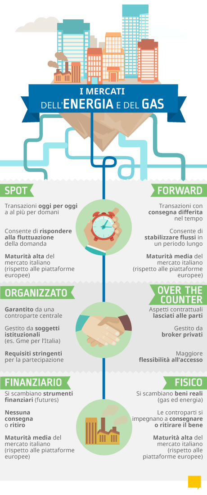

### Mercati Energia
<!-- Immagine dei mercat settore Energia -->

Termine
Mercato Forward
		
Categoria
Mercati Finanziari

Definizione
Mercato in cui le negoziazioni prevedono la consegna differita dell'attività oggetto di scambio, a un prezzo prestabilito all'atto della negoziazione stessa.

Approfondimento
Il mercato a termine viene anche definito mercato forward ed è caratterizzato dal fatto che all'atto della negoziazione gli operatori definiscono unicamente le caratteristiche del contratto (attività, scadenza, prezzo…), mentre la liquidazione (consegna dell'attività scambiata e pagamento del relativo controvalore) avrà luogo ad una data futura, alla scadenza del contratto.
Su tali mercati l'investitore ha la possibilità di fissare immediatamente le caratteristiche del contratto che intende negoziare, soprattutto il prezzo, per poi effettuare la consegna (dell'attività o del controvalore monetario) ad una data futura. Le transazioni relative ai mercati a termine possono avvenire su mercati regolamentati oppure fuori borsa (over the counter). I contratti a termine possono essere a termine fermo (derivati simmetrici, futures, forwards, swaps) quando alla scadenza lo scambio avviene alle condizioni stabilite al momento della negoziazione o a termine condizionato (derivati asimmetrici cioè opzioni), quando alla scadenza una delle parti (il compratore del contratto) ha la facoltà di decidere se dare esecuzione al contratto oppure no.

